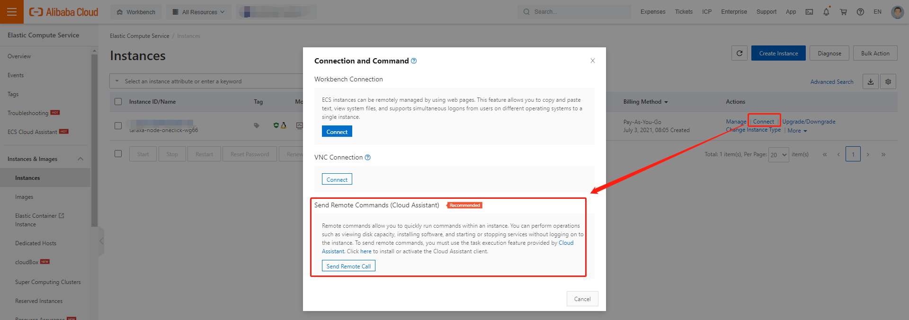

# Alibaba Cloud(Aliyun)

## 1. Register to Alibaba Cloud(Aliyun)

You can use the following link to get a discount:

[https://www.alibabacloud.com/referral?referralCode=iwa2ly](https://www.alibabacloud.com/referral?referralCode=iwa2ly)

## 2. Create AccessKeyId and AccessKeySecret

You can create AccessKeyId and AccessKeySecret on this page:

[AccessKeyId and AccessKeySecret](https://usercenter.console.aliyun.com/#/manage/ak)

Make a note of that key. It only shows once, you have to save it, and we will use it in the next step.

## 3. Creating a Taraxa Node


If you are running this on Windows you will first need to install Windows Subsystem for Linux. You can use [this guide](https://docs.microsoft.com/en-us/windows/wsl/install-win10).


Export your AccessKeyId and AccessKeySecret to your environment so that the node creation script can access it without prompting you for it:

```bash
export ALY_AK_ID=your_access_key_id
export ALY_AK_SECRET=your_access_key_secret
```

Then you can download and run the node creation script using this command:

```bash
bash -c "$(curl -fsSL https://raw.githubusercontent.com/Taraxa-project/taraxa-ops/master/scripts/one-click-Alibaba-Cloud.sh)"
```

Now you should see a new droplet in your Aliyun account and you should receive an email with the resources creating details.

_NOTE: It takes a few minutes after the droplet starts to install the Taraxa Node software, please don't restart or stop the new ECS instance._

## 4. Check the logs

You can send commands via Cloud Assistant, so you needn't remember the ECS instance password:



_NOTE: If you want to get the instance's password, you can reset password._

You can use the following commands to check if the node is up and running:

```bash
sudo docker ps

sudo docker logs taraxa_compose_node_1
```

