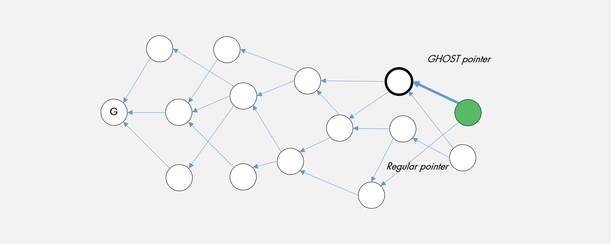
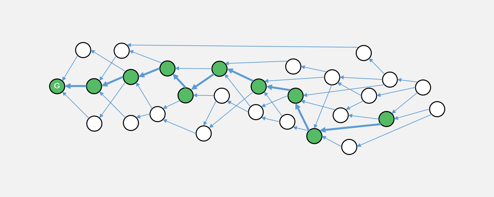
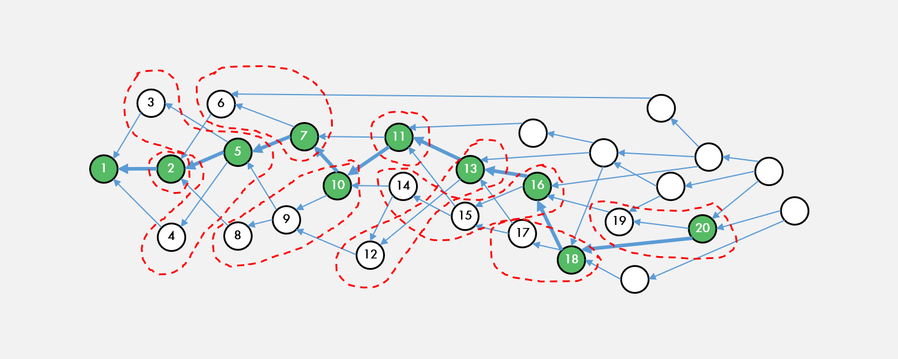
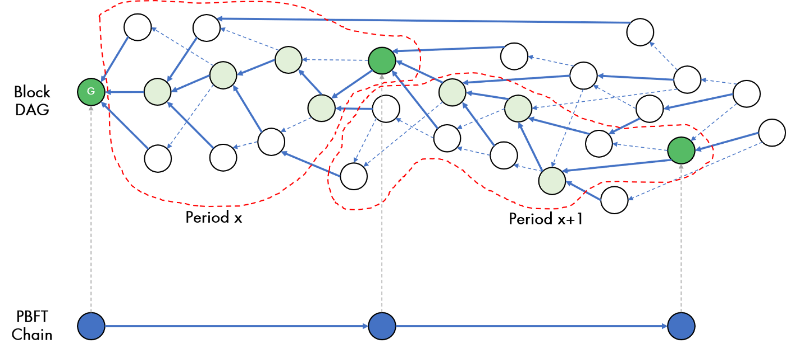

# Taraxa Architecture

## 2. Core Consensus

### 2.1 Brief Background

As the blockchain space matures, pioneering networks such as Bitcoin and Ethereum have run into scalability bottlenecks. One of the key scalability metrics is total network throughput, usually measured by transactions per second \(TPS\). For single-chain topologies, however, increasing TPS necessarily means a decrease in security, the recovery of which negates any TPS gains.

To increase TPS, the network could increase block size β and/or block generation rate γ. Increasing β necessarily increases network delay δ, because a bigger block of data takes longer to transmit. This in turn reduces the timeliness with which all nodes hear about the block, thus increasing the likelihood of branching. Increasing γ has the effect of increasing the number of blocks proposed on the network, but since on a single-chain topology only a single block can ever be accepted, more blocks actually increases the options nodes have to make the incorrect bet on the longest chain, leading to branching. Hence, we see a hard tradeoff between TPS and security [\[4\]](). The loss of security is attributable to the fact that while honest nodes are not coordinated, whereas as a malicious adversary can coordinate off-chain to produce a branch-free set of blocks and thus determine the longest chain.

* **βγ ∝ TPS**: block size and block generation increase TPS
* **β ∝ δ**: block size increase network delay 
* **δγ ∝ branching**: network delay and block generation increase branching \(decreases security\)

One elegantly simple approach is to abandon the single-chain approach and adopt an inclusive approach in the form of a DAG [\[7\]](), or specifically a block DAG. In a block DAG, blocks could be proposed by multiple nodes and they would all be accepted if they were valid. Additionally, unlike in a single-chain topology, each block could reference not just a single parent, but multiple parents – in fact as many parents as the proposing node sees tips in their current view of the DAG. A critical property of such a DAG is that that it removes the hard tradeoff between TPS and security, as the network could reliably increase β without sacrificing security. To see why this is, recall that increasing β would lead to an increase in branching. However, instead of following the simple longest chain rule of a linear blockchain, the acknowledged parent and tips recorded into each block be used to provide crucial information for block ordering. Without the additional overhead of voting, the ability for one block to point to another is a de-facto vote that the blocks referenced as parents and tips should be ordered ahead of the new block. This key property can be combined by the use of the GHOST rule to create an inclusive block protocol that maintains security independent from branching rate [\[7\]]().


However, the block DAG topology isn’t without its own set of challenges, here are a few,

* Ordering convergence
* Finality \(confirmation latency\)
* Block efficiency - overlapping block contents

Taraxa sets out to address these issues.

### 2.2 Ordering via Anchor Chain

To ensure that the block DAG reaches rapid convergence amongst nodes, we note that not all parent block references need to be equal. The ordering algorithm originally proposed by GHOSTDAG [\[7\]]() takes a two-step process: separating the DAG into blue vs. red clusters, and then using the GHOST rule to map out an induced chain within the blue cluster.

Here we note that you could remove the need for the initial clustering by simply allowing implicit voting via the block pointers on what each of the proposers think happens to be the heaviest block \(analogous with Bmax in GHOSTDAG\) at the time of the proposal. This idea was first proposed by the OByte \(formerly Byteball\) project [\[8\]]() whereby one of the parents referenced is called the “best parent”. Unlike in OByte, the best parent is not determined by a set of "trusted witnesses", but rather by the tool we already have at our disposal, the GHOST rule.



At any given moment, a node can independently calculate which of the tips on the DAG it observes is the heaviest tip according to a modified version of the GHOST rule. In the original GHOST rule, all pointers are of equal weight. In Taraxa, the weight calculations only involve GHOST pointers – those that the proposing nodes calculated to be the heaviest. The remaining regular pointers are involved in total ordering. This mechanism guarantees an exponential falloff of reordering risk within the block DAG over time, and that different nodes’ view of which blocks are considered the heaviest blocks rapidly converge over time.

Taraxa’s use of Periods \(see [Section 4]().3\) help to bound the complexity of the weights calculations, as the traversal stops upon hitting blocks that are members of a previously finalized Period.

From any block on the block DAG by following the heaviest blocks forward \(towards the newest blocks\), we can construct an Anchor Chain inside the DAG, much like the Main Chain proposed by OByte.



Here’s a breadth-first algorithm which calculates weights for a yet-to-be-finalized Period, which is executed whenever a new block is being proposed.

```text
--------------------------------------------------------------------------------
Algorithm 1: calculate the weights of each block in a non-finalized Period
--------------------------------------------------------------------------------
Input: S – a set of tips visible to the node
Output: W – a dictionary of blocks and weights for the current non-finalized Period
  1:  function CALCULATEWEIGHTS (S):
  2:    current_layer ← S
  3:      while current_layer is not empty:
  4:        for each block in current_layer:
  5:          parent ← GHOST parent of block  
  6:          if parent does not belong to a finalized Period then 
  7:            if parent is not in parent_layer then
  8:              add parent into parent_layer
  9:              insert parent into W with a weight of 1
  10:            else
  11:              increment W(parent)’s weight by W(block)
  12:        current_layer ← parent_layer
  13:        parent_layer ← {empty set}
  14:   return W
  15: end function
--------------------------------------------------------------------------------
```

In practice, as blocks are continuously added to the DAG the weights are updated and the Anchor Chain is calculated by the simple traversal of the GHOST path. The Anchor Chain is used to later determine total ordering between two Period Blocks, and the tip of the Anchor Chain is viewed as the block that all honest nodes should build off of, in that a newly proposed block’s ghost pointer will point to the tip of the Anchor Chain.

Below is an algorithm which determines the Anchor Chain. Here we assume that, unlike a typical DAG, there exist forward pointers from parent to the child block that has a GHOST pointer pointing back to it. In actual implementation such relationships are generated and discarded at runtime.

```text
--------------------------------------------------------------------------------
Algorithm 2: calculate the Anchor Chain
--------------------------------------------------------------------------------
Input: P – previous Period Block, W – a map of blocks and weights for the current non-finalized Period
Output: anchor_chain – a set (that preserves insertion order) of blocks that form the Anchor Chain 
  1:  function FINDANCHORCHAIN (P, W):
  2:    current_block ← P
  3:    while current_block has children:
  4:       children_weights ← map (block, weights) from current_block’s children ∩ W on block references
  5:        heaviest_child ← the block with the maximum weight in children_weights
  6:        add heaviest_child to the end of anchor_chain
  7:        current_block ← heaviest_child
  8:    end while
  9:    return anchor_chain
  10: end function
--------------------------------------------------------------------------------
```

Total ordering, for a given DAG, becomes completely deterministic once the Anchor Chain is calculated. Traverse the block DAG starting from the previously-finalized Period Block down the Anchor Chain, and for every Anchor Block, find its parents \(excluding the previous Anchor Block\) which constitutes an epoch. Topologically sort the epoch with tie breaking via the lowest block hash and keep moving down the Anchor Chain until it has been exhausted.



```text
--------------------------------------------------------------------------------
Algorithm 3: calculate the total ordering of the block DAG  
--------------------------------------------------------------------------------
Input: anchor_chain – a set of blocks that form the Anchor Chain for the currently non-finalized Period
Output: ordering – total ordering of the currently non-finalized Period 
  1:  function ORDERPERIOD (anchor_chain):
  2:    for each anchor_block in anchor_chain:
  3:      epoch ← set of parents for anchor_block, excluding the previous block in the anchor_chain
  4:      sorted_epoch ← topologically-sorted epoch, with tie-breakers via lowest block hash
  5:      add sorted_epoch to the end of ordering
  6:    return ordering
  7:  end function
--------------------------------------------------------------------------------
```

### 2.3 Rapid Finalization

In many blockchain networks, finality is a matter of probability. For example, in Bitcoin the convention is to wait for a transaction to be 6 blocks deep [\[9\]]() \(which takes on average 60 minutes\) into the chain before accepting it as “finalized”, however the risk of network reordering and state reversion is never zero, and the exact probabilities depend on the assumed hash power of the attacker. The longest chain rule provides eventual finality, if you wait infinitely long, but not true or instant finality.

This lack of instant true finality also applies for the block DAG, whereby the reordering risk falls off exponentially but at not instant ever becomes zero. This may be acceptable for small, coin-only transactions, but often unacceptable for high-valued transactions and especially for smart contracts.

Smart contracts are logic built on top of the blockchain. Unlike simple coin transfers which exhibit only a single behavior – modifying the states of two predefined accounts, a smart contract could \(and often do\) impact many accounts at once, many of those could themselves be smart contracts and trigger a large-scale cascade of impact. On top of which, many smart contracts implement mechanisms with branching conditions based on previous states – e.g., auctions and trading algorithms. All of this makes having a truly finalized state critically important.

To quickly reach true finalization, we use a VRF-enabled fast PBFT process first proposed by the Algorand [\[10\]]() project, in which a randomized subset of the network is chosen to cast a vote, through a process of cryptographic sortition. Unlike in Algorand and other similar protocols, this mechanism is asynchronous with block generation in the block DAG.

As the block DAG grows, the network takes successive votes to place “infinite” weight on a specific Anchor Block, which then becomes a Period Block. 


The irrevocable commitment of Anchor Block selection by byzantine agreement is thus adapted to GHOST rule by treating the commitment as “infinite” weight, thereby short-circuiting the need to wait an infinite time. Having committed to an Anchor Block, the finality is instantaneous. The voting result is encoded into blocks on the PBFT Chain. 



This vote is very simple because it is not a vote on the contents or the validity of the block – that has been achieved already when constructing the block DAG by implicit voting through gossiping the block throughout the network – but purely on whether or not this is the Anchor Block that should become a Period Block. A much simpler vote means the voting process is much faster, as there are less assertions to validate among the randomly-selected committee members. Once a Period Block has been finalized, all blocks connected between the new Period Block and the last Period Block now have a deterministically-defined \(in other words, finalized\) ordering, forming a new Period within the block DAG.

Encoded inside the blocks on the Finalization Chain are not just the Period Block and their associated votes \(multi-signature is on the roadmap\) but also a schedule of all transactions within all the blocks included in the Period after the ordering of the blocks have been finalized. Another critical function of the schedule is to identify overlapping transactions between blocks - for network reliability and security purposes, the overlap cannot be zero - so that they are removed from the aggregate schedule. A transaction is considered overlapping if, after the absolute ordering of the blocks have been established, transactions occurring in a later block has already appeared in an earlier block, then the one in the later block is considered overlapping and removed. The associated fee rewards for processing overlapping transactions are also removed. To further incentivize honest behaviors during block proposals, blocks in the DAG that exceed a certain overlap percentage will not receive block rewards.

This finalization process is asynchronous to block generation. As the block DAG at the top grows, it is only concerned with transaction inclusion – in fact nodes do not even execute the transactions within the blocks. The block DAG is just for block validation, transaction inclusion, and fair transaction ordering and grows completely independently of the finalization and execution process that happens through voting.

Lastly, having finalized periods across the block DAG effectively caps the computational complexity of calculating weights via GHOST, as any node only needs to recursively calculate weights until it hits a confirmed Period Block.

### 2.4 Fair & Efficient Proposals

The first driver of wasted blocks is that there could simply be too many blocks if no rate-limiting mechanisms are in place. Classic blockchain projects like Bitcoin and Ethereum relies on Proof of Work \(PoW\) as a way to rate-limit block generation, but Taraxa uses a Proof of Stake \(PoS\) and we believe that the sheer amount of energy expended by PoW is not sustainable or socially responsible – we’d need a non-energy destroying method of limiting block generation rates.

Taraxa developed an algorithm that drives Fair and Efficient Proposals by leveraging Verifiable Random Function \(VRF\) and Verifiable Delay Function \(VDF\). VRF was first proposed by Micali et al. [\[11\]](). It is a pseudo-random function which provides a proof of the outputs' correctness. VRFs also have the added property that the output is indistinguishable from a uniform function given an unpredictable input. VDF is a function that is meant to take a prescribed amount of time to compute, is highly resistant to parallel computations \(i.e., avoids the hardware arms race of PoW\), and whose output is extremely fast to verify. Taraxa makes use of a VDF first described by Wesolowski [\[12\]]().

At any given moment, a node's eligibility to propose a block requires the successful computation of a VDF with a difficulty factor set by a VRF. The VRF's inputs are simply the signature of the latest observed Period Block hash and the current level of the block DAG at which the node wishes to propose a block. The VDF is then adjusted for difficulty according to the output of the VRF, and the VDF's inputs are the block hash of the terminating DAG tip of the computed Anchor Chain, and the same inputs as the VRF.

This method allows any eligible node to propose a block once the VDF has been properly computed, removing the possibility of deadlocks occurring on the block DAG \(i.e., no blocks are produced\). However, the other implication of this property is that since blocks can always be proposed, we could end up with as many blocks as eligible node proposing nodes, potentially opening the network to block DAG reordering attacks.

To resolve this, we define a difficulty threshold, beyond which a block has no weight via the GHOST rule and hence cannot increase the weight of any blocks they point to, effectively removing their impact in ordering. While after computing the VRF for the current level, a node should immediately know whether or not its difficulty exceeds the threshold. This however should not prevent an _honest_ node from keep computing the VDF as there's always a non-zero chance of deadlock - i.e., the statistically improbable outcome that all eligible nodes computed VRF that exceeded the difficulty threshold. An honest node would continue on to compute the VDF, while monitoring the network traffic. If the honest node observes that the expected number of blocks at the current level as defined by the difficulty threshold has been gossiped around, then it should stop computing the VDF and start a new VRF-VDF cycle for the next level, as the block it will eventually produce at the previous level is likely going to be heavily overlapping with those already produced and hence no longer useful to the network. As long as the expected number of blocks at the level is not observed, the honest node will keep calculating the VDF to its conclusion and produce its intended block.

Note that it is also financially unprofitable to add blocks into the block DAG after observing a good many blocks appearing at the current level. The "late" block is guaranteed to be ordered behind the previously observed blocks, and because it is late, its transactions have a high probability of overlapping with those blocks that came before. Since the finalization process removes overlapping transactions, the late block producer receiving little to no rewards from fees. Rules could also be instituted that block rewards are also tied to a minimum threshold of block efficiency, refusing payout to those nodes producing blocks with a high percentage of overlapping transactions.

The algorithm below describes a node's decision-making process while proposing.

```text
--------------------------------------------------------------------------------
Algorithm 4: block proposal eligibility  
--------------------------------------------------------------------------------
Input: period_block_hash - latest period block's hash, level - the level of the block DAG to build on relative to the latest period block, anchor_tip_hash - current anchor chain's tip on the block DAG, difficulty_threshold - the difficulty beyond which the block will no longer have weight in the GHOST rule, no_expected_blocks - number of expected blocks at the current level 
Output: eligible - whether the node should publish, proof - proof of eligibility
  1:  function PROPOSALELIGIBILITY (period_block_hash, level, anchor_tip_hash, difficulty_threshold):
  2:    rnd ← VRF (S(concatenate( period_block_hash, level)))
  3:    difficulty ← ( rnd / MAX_VRF_INTEGER_OUTPUT ) * difficulty_threshold
  4:    VDF_d ← VDF_function_generator (VDF(), difficulty)
  5:    output_vdf ← concatenate(anchor_tip_hash, period_block_hash, level)
  6:    for i = 1 to difficulty
  7:      output_vdf ← VDF_d (output_vdf)
  8:      cur_blocks ← most updated number of blocks seen through gossip at the current level
  9:      if cur_blocks >= no_expected_blocks then
  10:       eligible ← false
  11:       proof ← null
  12:       return (eligible, proof)
  13:   eligible ← true
  14:   proof ← (output_vdf, period_block_hash, anchor_tip_hash)
  15:   return (eligible, proof) 
  16: end function
--------------------------------------------------------------------------------
```

### 2.5 Transaction Jurisdiction

The second driver of wasted blocks is that transactions contained within different blocks could overlap with one another, causing redundancy. The most basic strategy to control this is to require that when a block is proposed, it contains none of the transactions included in the tips \(parents\) it is referencing. The proposer further has no financial incentive to reference older transactions in non-tip blocks as its block would likely either be rejected as malicious, or that these redundant transactions will be pruned during execution and proposer would have received nothing for its efforts. But this basic approach is often not enough if transactions begin to flood the network.

Taraxa implements an algorithm that defines Transaction Jurisdiction for each node when they propose blocks in order to minimize overlap.


To define transaction jurisdiction, a proposer follows an algorithm that places it into a specific range of transaction addresses \(or accounts\) for which it has jurisdiction over. In other words, the proposer is only eligible to pack transactions from addresses within its jurisdiction into a new block. A proposer first signs an Anchor Block and then hashes the signature, receiving a certificate. This certificate is then mapped into the pool of pending transactions to see which ones the current node is eligible for. This could be done via a simple modulus operation, for example, as described in the simple algorithm below.

```text
--------------------------------------------------------------------------------
Algorithm 5: find transactions within the proposer node’s jurisdiction
--------------------------------------------------------------------------------
Input: P – pool of pending transactions, N – number of jurisdictional shards, past_period_block_id – the id of a past period block (e.g., the past 2nd from the current non-finalized Period) 
Output: available_tx – subset of pending transactions this node has jurisdiction over 
  1:  function FINDTXJURISDICTIONSET (P, N):    
  2:    jurisdiction_cert ← hash of the proposing node’s signature of past_period_block_id
  3:    for each transaction in P:
  4:      if (transaction modulo N) equals (jurisdiction_cert modulo N) then
  5:        add transaction to available_tx
  6:    return available_tx
  7:  end function
--------------------------------------------------------------------------------
```

Note that the block id of the past Period block and its signature need to be part of the block to act as proof to help other nodes to validate whether the correct jurisdiction has been used. For each such jurisdiction proof generated, it will remain valid for two \(2\) Periods to account for fuzzy boundary conditions between Periods due to propagation latency.

Also note that, the implicit definition of work load in this algorithm is simply the transaction count. This is a reasonable measure of load during block generation since, in the Taraxa protocol, blocks on the block DAG are not executed immediately so the resulting computational load is purely based on validation, which is a relatively simple and fixed workload for both coin and smart contract transactions.

In both cases, there is no coordination between the nodes on block proposal eligibility and transaction jurisdiction and a certain amount of tolerance or “fuzziness” is built into the validation, thereby reducing the associated network overhead and attack surface.

## 3. Execution Layer Optimization

### 

## 4. Technical Roadmap

\*\*\*\*

